# 🤖 Daily AI Briefing Automation

매일 아침 AI 연구 동향을 생성해 Notion 데이터베이스로 적재하는 자동화 저장소입니다.

## SKILL.md 기반 구조

이 저장소는 운영/수정 작업을 빠르게 수행할 수 있도록 `SKILL.md` 중심으로 구조화되어 있습니다.

- `SKILL.md`: 작업 절차, 우선순위, 검증 체크리스트
- `references/ops-playbook.md`: 운영 가이드(시크릿, 스케줄, 장애 대응)
- `references/notion-schema.md`: Notion 스키마 기준 문서

## 빠른 시작

```bash
cp .env.example .env
# .env에 API 키/DB ID 입력
pip install -r requirements.txt
python daily_ai_briefing.py
```

## GitHub Actions

- 워크플로우: `.github/workflows/daily-briefing.yml`
- 기본 스케줄: `0 0 * * *` (매일 09:00 KST)
- 수동 실행: `workflow_dispatch`

## 코드 구조 (Mermaid)

```mermaid
flowchart TD
    A["daily_ai_briefing.py<br/>메인 엔트리포인트"] --> B["환경 변수 로드<br/>python-dotenv"]
    A --> C["generate_briefing<br/>with_claude"]
    A --> D["add_to_notion<br/>_database"]
    A --> E["main"]

    C --> C1["Anthropic API 호출<br/>web_search tool"]
    C1 --> C2["JSON 파싱<br/>items/references 반환"]

    E --> E1["브리핑 생성"]
    E1 --> E2["items 반복 처리"]
    E2 --> D
    E2 --> E3["성공/실패 집계"]

    D --> D1["Notion Page<br/>Payload 구성"]
    D1 --> D2["requests.post<br/>/v1/pages"]
    D2 --> D3["업로드 결과 로그"]

    F["references/ops-playbook.md<br/>운영/배포 가이드"] -.참조.- A
    G["references/notion-schema.md<br/>Notion 속성 규격"] -.참조.- D1
    H["SKILL.md<br/>운영 절차/검증 체크리스트"] -.참조.- A
```


